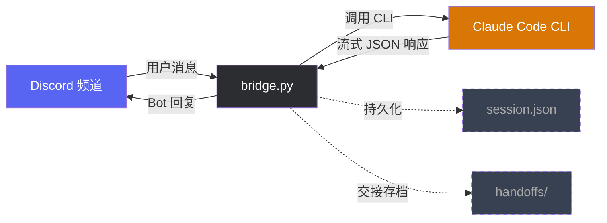

# Claude Discord Bridge

Single-file bridge that connects a Discord channel to [Claude Code CLI](https://docs.anthropic.com/en/docs/claude-code), letting you talk to Claude from your phone or any device via Discord.

---

**[中文说明见下方](#中文说明)**

## Architecture

```
Discord Channel          bridge.py              Claude Code CLI
┌──────────────┐    ┌─────────────────┐    ┌──────────────────┐
│  User sends  │    │                 │    │                  │
│  a message   │───>│  discord.py     │    │  claude -p       │
│              │    │  on_message()   │───>│  --output-format │
│              │    │                 │    │  stream-json     │
│  Bot replies │<───│  parse stream   │<───│                  │
│  in channel  │    │  JSON output    │    │  (local process) │
└──────────────┘    └─────────────────┘    └──────────────────┘
                            │
                    ~/.claude-discord-bridge/
                        session.json
                        bridge.log
                        handoffs/
```

- **Single process** — no queue, no database, no extra services
- **Session continuity** — maintains conversation context across messages via Claude Code's `--session-id` / `-r` flags
- **Auto-recovery** — if session resume fails, automatically creates a new session
- **macOS LaunchAgent** — runs as a persistent daemon with auto-restart

## Prerequisites

- macOS (Linux should work too, but LaunchAgent is macOS-specific)
- Python 3.10+
- [Claude Code CLI](https://docs.anthropic.com/en/docs/claude-code) installed and authenticated
- A Discord Bot with Message Content Intent enabled

## Quick Start

```bash
# Clone
git clone https://github.com/who96/claude_bridge_discord.git
cd claude_bridge_discord

# Install
python3 -m venv .venv
.venv/bin/pip install -r requirements.txt

# Run
DISCORD_TOKEN="your-bot-token" CHANNEL_ID="your-channel-id" .venv/bin/python3 bridge.py
```

## Environment Variables

| Variable | Required | Default | Description |
|---|---|---|---|
| `DISCORD_TOKEN` | Yes | — | Discord bot token |
| `CHANNEL_ID` | Yes | — | Discord channel ID to listen on |
| `CLAUDE_CWD` | No | `$HOME` | Working directory for Claude Code CLI |
| `CLAUDE_BIN` | No | `claude` | Path to Claude Code CLI binary |
| `CLAUDE_TIMEOUT` | No | `300` | Max seconds per Claude call |
| `CLAUDE_MODEL` | No | — | Override Claude model (e.g. `claude-sonnet-4-5-20250514`) |
| `CLAUDE_SKIP_PERMISSIONS` | No | `0` | Set to `1` to pass `--dangerously-skip-permissions` |
| `SELFTEST_ON_START` | No | `0` | Set to `1` to run a self-test on startup |

## Discord Bot Setup

1. Go to [Discord Developer Portal](https://discord.com/developers/applications)
2. Create a new Application
3. Go to **Bot** → copy the Token
4. Enable **Message Content Intent** under Privileged Gateway Intents
5. Go to **OAuth2** → **URL Generator**, select `bot` scope with permissions: `Send Messages`, `Read Message History`, `Add Reactions`
6. Use the generated URL to invite the bot to your server

## Commands

| Command | Description |
|---|---|
| `/new` | Reset conversation session |
| `/status` | Show current session ID, working directory, timeout |
| `/connect [session-id]` | Connect to a specific session (no args = reset) |
| `/handoff` | Handoff current session (summarize → cold-start a new session) |
| `/help` | Show available commands |

All other messages in the channel are forwarded to Claude Code CLI.

## Run as macOS LaunchAgent

Copy and edit the example plist:

```bash
cp com.claude.discord-bridge.plist.example ~/Library/LaunchAgents/com.claude.discord-bridge.plist
# Edit the plist: set your paths, token, and channel ID
```

Load and start:

```bash
launchctl load ~/Library/LaunchAgents/com.claude.discord-bridge.plist
```

Stop:

```bash
launchctl stop com.claude.discord-bridge
```

Logs:

```bash
tail -f ~/.claude-discord-bridge/bridge.log
tail -f ~/.claude-discord-bridge/bridge.err.log
```

## How It Works

1. Discord bot listens for messages in the configured channel
2. On receiving a message, calls `claude -p --verbose --output-format stream-json`
3. Parses the streaming JSON output, extracts assistant text
4. Sends the response back to Discord (auto-splits messages > 2000 chars)
5. Session ID is persisted to `~/.claude-discord-bridge/session.json` for conversation continuity
6. Concurrent messages are serialized via `asyncio.Lock` (queued messages get a hourglass reaction)

## License

MIT

---

# 中文说明

单文件桥接工具，把 Discord 频道连接到本地的 [Claude Code CLI](https://docs.anthropic.com/en/docs/claude-code)，让你可以在手机或任何设备上通过 Discord 与 Claude 对话。

## 架构



- **单进程** — 没有消息队列，没有数据库，没有额外服务
- **会话连续** — 通过 Claude Code 的 `--session-id` / `-r` 参数保持对话上下文
- **自动恢复** — 会话恢复失败时自动创建新会话
- **macOS 常驻** — 通过 LaunchAgent 实现开机自启和崩溃重启

## 前提条件

- macOS（Linux 理论上也能跑，但 LaunchAgent 是 macOS 特有的）
- Python 3.10+
- [Claude Code CLI](https://docs.anthropic.com/en/docs/claude-code) 已安装并完成认证
- 一个开启了 Message Content Intent 的 Discord Bot

## 快速开始

```bash
# 克隆
git clone https://github.com/who96/claude_bridge_discord.git
cd claude_bridge_discord

# 安装
python3 -m venv .venv
.venv/bin/pip install -r requirements.txt

# 运行
DISCORD_TOKEN="你的bot-token" CHANNEL_ID="你的频道ID" .venv/bin/python3 bridge.py
```

## 环境变量

| 变量 | 必填 | 默认值 | 说明 |
|---|---|---|---|
| `DISCORD_TOKEN` | 是 | — | Discord Bot Token |
| `CHANNEL_ID` | 是 | — | 监听的 Discord 频道 ID |
| `CLAUDE_CWD` | 否 | `$HOME` | Claude Code CLI 的工作目录 |
| `CLAUDE_BIN` | 否 | `claude` | Claude Code CLI 的路径 |
| `CLAUDE_TIMEOUT` | 否 | `300` | 单次 Claude 调用的超时秒数 |
| `CLAUDE_MODEL` | 否 | — | 指定 Claude 模型（如 `claude-sonnet-4-5-20250514`） |
| `CLAUDE_SKIP_PERMISSIONS` | 否 | `0` | 设为 `1` 则传递 `--dangerously-skip-permissions` |
| `SELFTEST_ON_START` | 否 | `0` | 设为 `1` 则启动时执行自检 |

## 创建 Discord Bot

1. 打开 [Discord Developer Portal](https://discord.com/developers/applications)
2. 新建 Application
3. 进入 **Bot** → 复制 Token
4. 在 Privileged Gateway Intents 中开启 **Message Content Intent**
5. 进入 **OAuth2** → **URL Generator**，勾选 `bot`，权限选 `Send Messages`、`Read Message History`、`Add Reactions`
6. 用生成的链接邀请 Bot 到你的服务器

## 命令

| 命令 | 说明 |
|---|---|
| `/new` | 重置对话会话 |
| `/status` | 查看当前会话 ID、工作目录、超时时间 |
| `/connect [session-id]` | 连接指定会话（无参数则重置） |
| `/handoff` | 交接当前会话（总结→冷启动新会话） |
| `/help` | 显示可用命令 |

频道内其他所有消息都会转发给 Claude Code CLI 处理。

## 配置为 macOS LaunchAgent

复制并编辑示例 plist：

```bash
cp com.claude.discord-bridge.plist.example ~/Library/LaunchAgents/com.claude.discord-bridge.plist
# 编辑 plist：设置你的路径、Token 和频道 ID
```

加载启动：

```bash
launchctl load ~/Library/LaunchAgents/com.claude.discord-bridge.plist
```

停止：

```bash
launchctl stop com.claude.discord-bridge
```

查看日志：

```bash
tail -f ~/.claude-discord-bridge/bridge.log
tail -f ~/.claude-discord-bridge/bridge.err.log
```
